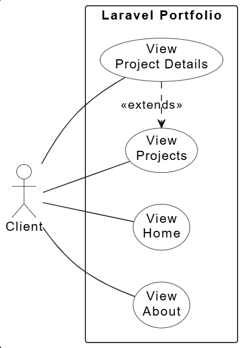
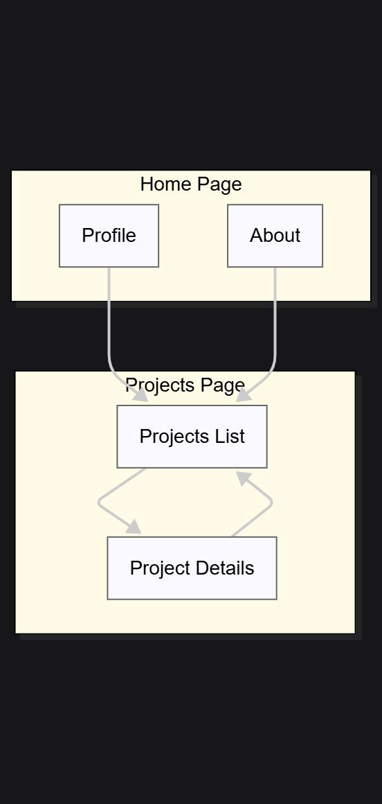

# Developer Portfolio Mini-Site  
**by Amin Mohamed Abou Amasha**  
*Supervised by: Essarraj Fouad*  
*Group: DM101*

---

## Analysis: Requirements Specification

- **Context**: Portfolio – Laravel – Services  
- **Objective**: Profile – Skills – Projects – Contact  
- **For**: Mallouli Abdelhay  
- **Users**: Clients – Students  
- **Pages**: Home – Projects – Details – About  
- **Design**: Clean – Responsive – Fast – Black and White

---

## Analysis: Use Case Diagram

---

## Analysis: Example of an Inspiring Site

---

## Conception: Schema

---

## Conception: Maquette

---

## Conception: digrameClass

---

# Thank You 
